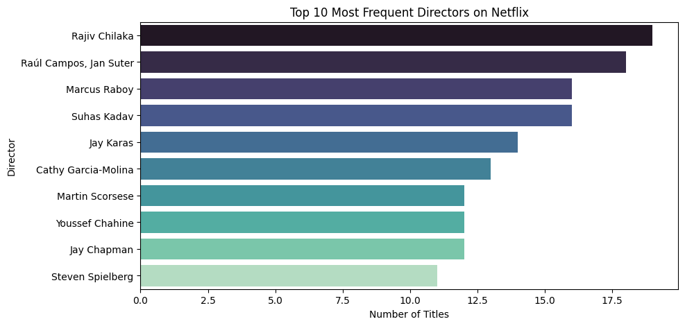
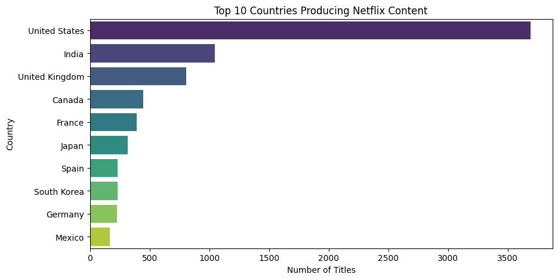
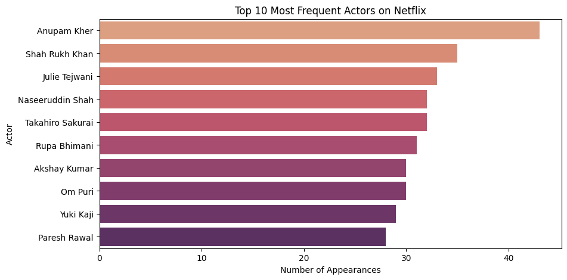
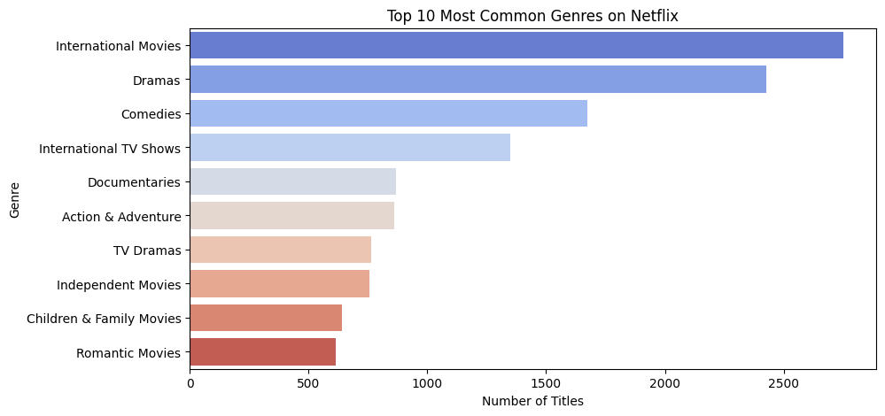

# 📊 Netflix Movies & TV Shows - Exploratory Data Analysis & Dashboard

This project involves deep exploratory data analysis (EDA) on Netflix's catalog of Movies and TV Shows using Python. We cleaned, visualized, and interpreted trends from Netflix content, and prepared a clean dataset for dashboarding in Power BI or Tableau.

---

## 📁 Dataset

- **Source**: [Netflix Titles Dataset on Kaggle](https://www.kaggle.com/shivamb/netflix-shows)
- **File Used**: `netflix_titles.csv`
- **Size**: ~7,800+ rows

---

## 🛠️ Tools & Libraries

- Python, Jupyter Notebook  
- pandas, numpy  
- matplotlib, seaborn  
- WordCloud  
- Power BI / Tableau (dashboard-ready CSV)  

---

## 📌 Key Objectives

- Handle missing data and clean features
- Feature engineer useful columns like `year_added`, `duration_int`, `genre_split`
- Identify top genres, actors, directors, and countries
- Visualize the growth of Netflix content over the years
- Save plots and prepare a dashboard-ready dataset

---

## 📊 Visualizations

All major charts were saved to the `/visuals` folder.

| Plot | Description |
|------|-------------|
|  | 📽️ Top Directors |
|  | 🌍 Top Countries Producing Netflix Content |
|  | 🎭 Most Frequent Cast Members |
|  | 🎬 Popular Genres on Netflix |

---

## 📈 Summary of Insights

- USA, India, and UK dominate the Netflix catalog.
- Movies make up the majority of Netflix content.
- Genres like Drama, Comedy, and Documentary are most common.
- A few directors and actors repeatedly show up in top content.
- Most Netflix content was added between 2017–2020.

---

## 📂 Project Structure

netflix-eda-dashboard/
├── Netflix_EDA.ipynb         # Jupyter notebook with all analysis
├── netflix_cleaned.csv       # Cleaned data for dashboarding
├── netflix_titles.csv        # Raw dataset
├── visuals/                  # All saved charts
│   ├── genre_dist.png
│   ├── top_actors.png
│   ├── top_countries.png
│   └── top_directors.png
├── README.md  

---

## 🔮 Future Improvements

- Add interactive Power BI or Tableau dashboard
- Create a recommendation system using genre & cast data
- Combine with IMDb or TMDB data for richer metadata

---

## 🙋‍♂️ Author

**Ishant**  
[GitHub](https://github.com/Ishantk2507)

---

## ⭐ Project Type

`#DataScience` `#EDA` `#Python` `#Netflix` `#Dashboard` `#Visualization`
